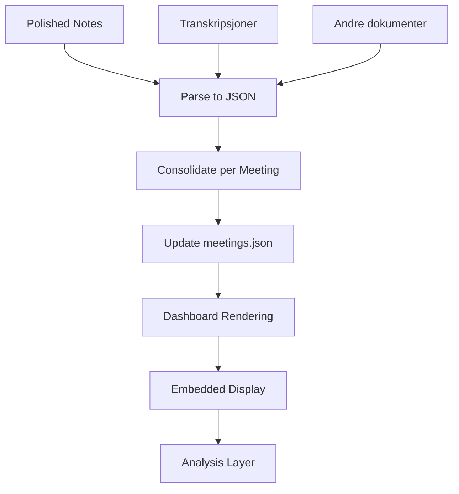

# IMPLEMENTERINGSPLAN: Embedded Meeting Notes

**Opprettet:** 2025-11-22
**Status:** Planlagt → I gang
**Estimert tid:** 2-3 timer

---

## 🎯 MÅL

Transformere møtenotater fra eksterne filer til **embedded, strukturert innhold** direkte i dashboardet.

### Før (nåværende):
- ❌ Notater åpnes i nytt vindu
- ❌ Forskjellige formater og strukturer
- ❌ Transkripsjoner/dokumenter spredt
- ❌ Vanskelig å analysere på tvers

### Etter (mål):
- ✅ Notater vises direkte i møtekortet
- ✅ Ett konsolidert referat per møte
- ✅ Konsistent struktur på alle
- ✅ Strukturert data for analyse
- ✅ Expandable seksjoner
- ✅ Søkbart og analyserbart

---

## 📋 IMPLEMENTERINGSSTEG

### STEG 1: Data Consolidation (45 min)

**Oppgave:** Merge alle notater/kilder til ett referat per møte

**Input:**
- `data/polished_notes/` - 24 polished notes
- `data/restructured_notes/` - rånotater
- Transkripsjoner og andre dokumenter
- `data/meetings.json` - eksisterende metadata

**Prosess:**
1. For hvert møte, identifiser alle relaterte dokumenter:
   - Polished note
   - Original note(s)
   - Transkripsjoner
   - Relaterte dokumenter

2. Parse polished note til strukturert JSON:
   ```json
   {
     "summary": "2-3 setninger",
     "discussion": [
       {
         "heading": "Tema 1",
         "content": "Diskusjonsinnhold..."
       }
     ],
     "decisions": ["beslutning 1", "beslutning 2"],
     "action_items": [
       {
         "task": "Oppgave",
         "responsible": "Person",
         "deadline": "2024-04-01"
       }
     ],
     "quotes": ["Viktig sitat 1"],
     "context": "Betydning og kontekst...",
     "transcript": "Full transkripsjon hvis tilgjengelig"
   }
   ```

3. Lagre strukturert data i `meetings.json`:
   ```json
   {
     "id": "m_2024-03-11",
     "date": "2024-03-11",
     "title": "...",
     "report": {
       "summary": "...",
       "discussion": [...],
       "decisions": [...],
       "action_items": [...],
       "quotes": [...],
       "context": "...",
       "has_transcript": true,
       "word_count": 1840,
       "sections": ["summary", "discussion", "decisions", "actions", "quotes", "context"]
     }
   }
   ```

**Output:**
- `data/meetings.json` med embedded report data
- `scripts/consolidate-meeting-reports.py` - Script for konsolidering
- `analysis/consolidation_report.md` - Rapport over hva som ble merged

---

### STEG 2: Dashboard Rendering (60 min)

**Oppgave:** Render embedded notater direkte i møtekort

**Komponenter:**

#### A. Markdown til HTML Parser
```javascript
// dashboard/lib/markdown-parser.js
const MarkdownParser = {
  parseToHtml(markdown) {
    // Parse markdown til HTML
    // Støtte for overskrifter, lister, sitater, osv.
  }
}
```

#### B. Meeting Report Renderer
```javascript
// I renderer.js
renderEmbeddedReport(report) {
  return `
    <!-- Summary (alltid synlig) -->
    <div class="report-summary">
      ${report.summary}
    </div>

    <!-- Expandable sections -->
    <div class="report-sections">
      ${this.renderDiscussionSection(report.discussion)}
      ${this.renderDecisionsSection(report.decisions)}
      ${this.renderActionItemsSection(report.action_items)}
      ${this.renderQuotesSection(report.quotes)}
      ${this.renderContextSection(report.context)}
      ${report.has_transcript ? this.renderTranscriptSection() : ''}
    </div>
  `;
}
```

#### C. Expandable UI
```css
.report-section {
  border: 1px solid #e5e7eb;
  border-radius: 8px;
  margin-bottom: 1rem;
}

.report-section-header {
  padding: 1rem;
  cursor: pointer;
  display: flex;
  justify-content: space-between;
}

.report-section-content {
  padding: 0 1rem 1rem;
  display: none;
}

.report-section.expanded .report-section-content {
  display: block;
}
```

**Output:**
- `dashboard/lib/markdown-parser.js` - Ny fil
- Oppdatert `dashboard/lib/renderer.js` - Embedded rendering
- Oppdatert `dashboard/styles.css` - Styling for embedded reports

---

### STEG 3: Enhanced Data Structure (30 min)

**Oppgave:** Utvide meetings.json med analyse-støtte

**Nye felter:**
```json
{
  "report": {
    // Eksisterende
    "summary": "...",
    "discussion": [...],

    // Nye for analyse
    "keywords": ["bærekraft", "områdeplan", "CO2"],
    "mentioned_people": ["Andreas", "Einar", "Gabriel"],
    "mentioned_organizations": ["Urbania", "R21 Arkitekter"],
    "related_documents": ["doc_123", "doc_456"],
    "related_meetings": ["m_2024-04-03"],
    "strategic_themes": ["Regulatory", "Sustainability"],
    "project_phase": "phase_2"
  }
}
```

**Output:**
- Utvidet `data/meetings.json` skjema
- `scripts/enhance-meeting-metadata.py` - Script for å berike metadata

---

### STEG 4: Analysis Layer (30 min)

**Oppgave:** Lag analyse-funksjonalitet på tvers av møter

**Funksjoner:**

```javascript
// dashboard/lib/meeting-analysis.js
const MeetingAnalysis = {
  // Finn alle beslutninger relatert til tema
  findDecisionsByTheme(theme) {
    return meetings
      .filter(m => m.report?.strategic_themes?.includes(theme))
      .flatMap(m => m.report.decisions)
  },

  // Finn alle action items for person
  findActionItemsForPerson(personName) {
    return meetings
      .flatMap(m => m.report?.action_items || [])
      .filter(a => a.responsible === personName)
  },

  // Timeline av nøkkelmilepæler
  getDecisionTimeline() {
    return meetings
      .filter(m => m.report?.decisions?.length > 0)
      .map(m => ({
        date: m.date,
        title: m.title,
        decisions: m.report.decisions
      }))
      .sort((a, b) => new Date(a.date) - new Date(b.date))
  },

  // Cross-reference med dokumenter
  getMeetingDocuments(meetingId) {
    const meeting = meetings.find(m => m.id === meetingId);
    return meeting.report?.related_documents?.map(docId =>
      documents.find(d => d.id === docId)
    );
  }
}
```

**Output:**
- `dashboard/lib/meeting-analysis.js` - Ny fil
- Analyse-funksjoner tilgjengelig i dashboard

---

### STEG 5: UI/UX Polish (15 min)

**Forbedringer:**

1. **Visuell hierarki**
   - Summary alltid synlig (grå bakgrunn)
   - Expandable seksjoner med ikoner
   - Smooth animations

2. **Keyboard navigation**
   - Tab gjennom seksjoner
   - Enter/Space for å åpne/lukke

3. **Search highlighting**
   - Uthev søkeord i notater
   - Scroll til relevant seksjon

4. **Print/Export**
   - Print-vennlig CSS
   - Export til PDF (valgfritt)

**Output:**
- Oppdatert CSS med animasjoner
- Print stylesheet
- Keyboard event handlers

---

## 📊 SUKSESSKRITERIER

### Funksjonalitet:
- ✅ Alle 24 møter har embedded notater
- ✅ Konsistent struktur på alle
- ✅ Expandable seksjoner fungerer
- ✅ Søk fungerer i embedded innhold
- ✅ Analyse-funksjoner tilgjengelige

### Kvalitet:
- ✅ Rask lasting (<2 sek for alle møter)
- ✅ Responsiv design (desktop + mobil)
- ✅ Tilgjengelig (keyboard navigation)
- ✅ Ingen eksterne filåpninger

### Data:
- ✅ Ett konsolidert referat per møte
- ✅ Alle transkripsjoner integrert
- ✅ Strukturert JSON for analyse
- ✅ Cross-referencing fungerer

---

## 🔄 ARBEIDSFLYT



---

## 📁 FILSTRUKTUR (ETTER)

```
project/
├── data/
│   └── meetings.json (✅ embedded report data)
│
├── dashboard/
│   ├── lib/
│   │   ├── renderer.js (✅ embedded rendering)
│   │   ├── markdown-parser.js (✅ ny)
│   │   └── meeting-analysis.js (✅ ny)
│   └── styles/
│       └── embedded-reports.css (✅ ny)
│
└── scripts/
    ├── consolidate-meeting-reports.py (✅ ny)
    └── enhance-meeting-metadata.py (✅ ny)
```

---

## ⏱️ TIDSPLAN

| Steg | Oppgave | Tid | Status |
|------|---------|-----|--------|
| 1 | Data Consolidation | 45 min | ⏳ Pending |
| 2 | Dashboard Rendering | 60 min | ⏳ Pending |
| 3 | Enhanced Data Structure | 30 min | ⏳ Pending |
| 4 | Analysis Layer | 30 min | ⏳ Pending |
| 5 | UI/UX Polish | 15 min | ⏳ Pending |
| **Total** | | **180 min** | |

---

## 🚀 OPPSTART

**Kommando for å starte:**
```bash
# Steg 1: Konsolider data
python3 scripts/consolidate-meeting-reports.py

# Steg 2-5: Automatisk via agent
# Agent vil implementere rendering, styling, og analyse-lag
```

**Agent vil:**
1. Parse alle polished notes til JSON
2. Merge transkripsjoner og dokumenter
3. Oppdatere meetings.json
4. Implementere dashboard rendering
5. Legge til analyse-funksjoner
6. Teste og verifisere

---

**Status:** 📋 Plan godkjent - Klar for implementering
**Neste:** Starter med Steg 1 - Data Consolidation
